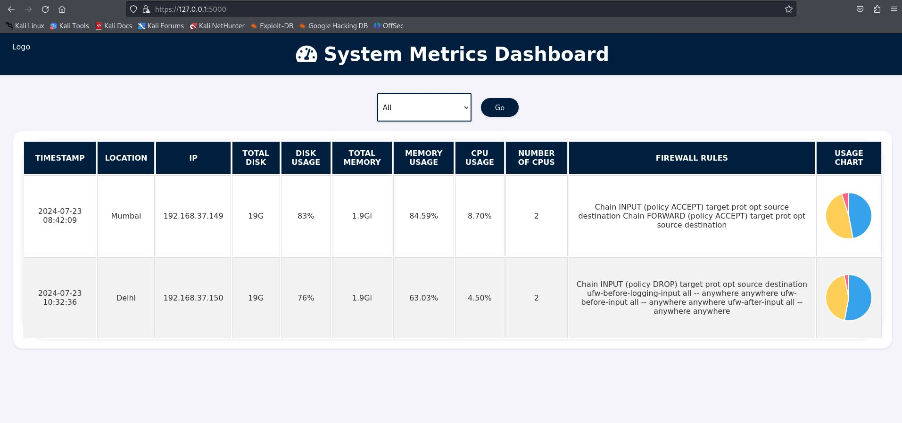
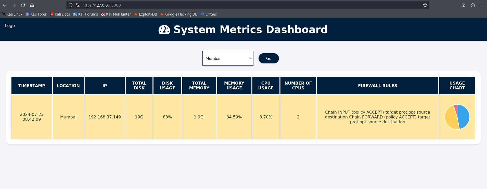

# Centralized System Health Monitoring System

## Overview
The Centralized System Health Monitoring System is designed to monitor the health metrics of multiple remote systems within a network. The project consists of two main components:

1. **Agent** (`p2.py`): This script runs on each remote system to gather metrics such as disk usage, memory usage, CPU usage, and firewall rules. It then sends this data to a central server.
2. **Dashboard** (`app.py` and `index.html`): The central server receives the data, stores it in a CSV file, and displays it on a web dashboard. The dashboard provides a visual representation of the system metrics for all connected remote systems.

## Setup

### Central Server Setup
1. Clone the repository to your central server.
2. Install the required Python packages:
    ```sh
    pip install paramiko requests pandas flask
    ```
3. Place the `certificate.pem` and `key.pem` files in the same directory as `app.py`. These files are used to enable HTTPS for the Flask web server.
4. Run the Flask application:
    ```sh
    python app.py
    ```

### Remote Agent Setup
1. Ensure Python is installed on all remote systems.
2. Transfer `p2.py` to each remote system.
3. Run the `p2.py` script on each remote system:
    ```sh
    python p2.py
    ```
4. The script will prompt for the central server IP, username, and password. Once provided, it will gather system metrics and send them to the central server.

## Dependencies/Prerequisites
- **Python 3.6+**
- **Python Libraries:**
  - `paramiko`
  - `requests`
  - `pandas`
  - `flask`
- **Certificates:**
  - `certificate.pem` and `key.pem` for HTTPS support

## .pem Files
The `.pem` files (`certificate.pem` and `key.pem`) are used to enable HTTPS for secure communication between the user’s browser and the Flask web server. Ensure these files are present in the project directory.

## Usage
1. Start the Flask server on the central system:
    ```sh
    python app.py
    ```
2. Run the agent script on each remote system:
    ```sh
    python p2.py
    ```
3. Access the dashboard by navigating to `https://<central_server_ip>:5000` in a web browser.

## Platform
The project has been tested on the following setup:
- **Central Server:** Kali Linux VM
- **Remote Systems:** Two Kali Linux VMs

## Technical Explanation
- **Agent Script (`p2.py`):** Collects system metrics using shell commands and Python libraries. Uses `paramiko` to securely transfer data to the central server. Prompts for server IP and credentials through a GUI using `tkinter`.
- **Central Server (`app.py`):** Hosts a Flask web server that reads metrics from a CSV file and displays them on a dashboard. The dashboard allows filtering by city and dynamically updates the display based on the selected city.
- **Dashboard (`index.html`):** Utilizes HTML, CSS, and JavaScript to create a user-friendly interface. Displays system metrics in a table format with color-coded rows based on usage thresholds. Includes a pie chart for visual representation of disk, memory, and CPU usage.




